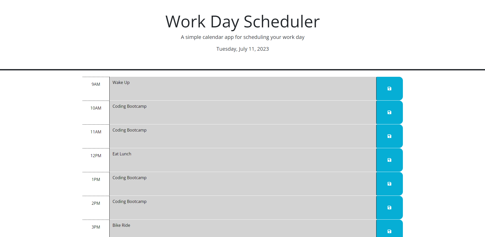

# Day Planner
This webpage serves as a day scheduler that allows the user to log important events throughout the day. The user will be able to save these events so that they will reappear even if the user reloads or exits the page. 



## Built With
* [JavaScript](https://developer.mozilla.org/en-US/docs/Web/JavaScript)
* [HTML](https://developer.mozilla.org/en-US/docs/Web/HTML)
* [CSS](https://developer.mozilla.org/en-US/docs/Web/CSS)
* [Git](https://git-scm.com/)
* [JQuery](https://jqueryui.com/about/)
* [Bootstrap](https://getbootstrap.com/docs/5.3/getting-started/introduction/)
* [DayJS](https://day.js.org/)
## Deployed Link

* [See Live Site](https://timothysu1.github.io/day-planner/)

## Usage
The user will be shown a page that displays the current date and time blocks that go from 9am to 5pm. The color of the block will reflect whether its the current block, a block that alreay happened, or a future block. The user will also be able to save the event they input by clicking on the save button to the right. Each save button will its corresponding block.


## Learning Points 
* Utilizing Jquery, Bootstrap, and DayJS
* Understanding *this* in the context where it is used
* Changing attributes of elements using Java Script

## Important Code

```js
 saveBtn.on("click", saveEvent)
  function saveEvent() {
    var targetHour = $(this).parent();
    var textArea = $(this).parent().find('.description').val();
    console.log(targetHour.attr("id"));
    localStorage.setItem(targetHour.attr("id"), textArea);
  }
```

This code allows the user to store what event they put into an hour block when they click its corresponding save button.


## Author Info

### Timothy Su

* [LinkedIn](https://www.linkedin.com/in/timothysu1/)
* [Github](https://github.com/timothysu1)


## Credits
JQuery Documentation: https://api.jquery.com/

## License

Please refer to license in the repo. 